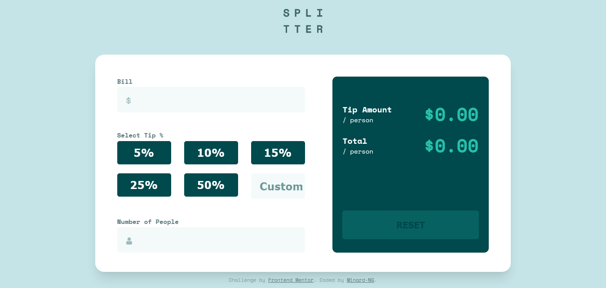

# Frontend Mentor - Tip calculator app solution

This is a solution to the [Tip calculator app challenge on Frontend Mentor](https://www.frontendmentor.io/challenges/tip-calculator-app-ugJNGbJUX). Frontend Mentor challenges help you improve your coding skills by building realistic projects.

## Table of contents

- [Overview](#overview)
  - [The challenge](#the-challenge)
  - [Screenshot](#screenshot-of-my-implementation)
  - [Links](#links)
- [My process](#my-process)
  - [Built with](#built-with)
  - [What I learned](#what-i-learnt)
  - [Continued development](#continued-development)
  - [Useful resources](#useful-resources)
- [Author](#author)
- [Acknowledgments](#acknowledgments)

## Overview

### The challenge

Users should be able to:

- View the optimal layout for the app depending on their device's screen size
- See hover states for all interactive elements on the page
- Calculate the correct tip and total cost of the bill per person

### Screenshot of my Implementation

### Links

- Solution URL: [GitHub Repo](https://github.com/Minard-NG/Tip-calculator)
- Live Site URL: [Hosted with Netlify](https://splittercalculator.netlify.app/)

## My process

### Built with

- Semantic HTML5 markup
- CSS custom properties
- Flexbox
- CSS Grid
- Scss/Sass
- Mobile-first workflow
- Git and GitHub

### What I Learnt

- Reinforced my knowledge on CSS3 grids and page layouts.
- Developed a crude implelementation of the typical radio button behaviour. 
- Practiced more functional programming

### Continued development

Continue building out awesome web applications

### Useful resources

- [Google Fonts](https://fonts.google.com/) - Awesome utility tool from Google, to help you plug in custom fonts.
- [Box Shadow](https://getcssscan.com/css-box-shadow-examples) - This is an amazing resource to get box shadow values and see values that work.

## Author

- Frontend Mentor - [@Minard-NG](https://www.frontendmentor.io/profile/Minard-NG)
- LinkedIn - [Michael Nwankwo](https://www.linkedin.com/in/michael-nwankwo/)

## Acknowledgments

Special thanks to [Frontend Mentor](https://www.frontendmentor.io/home) for setting up this challenge to help developers improve their coding skills by building realistic projects.